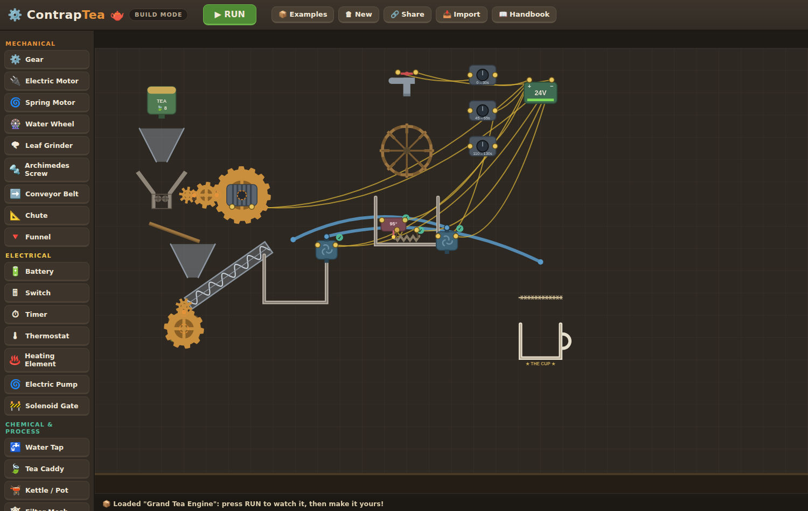
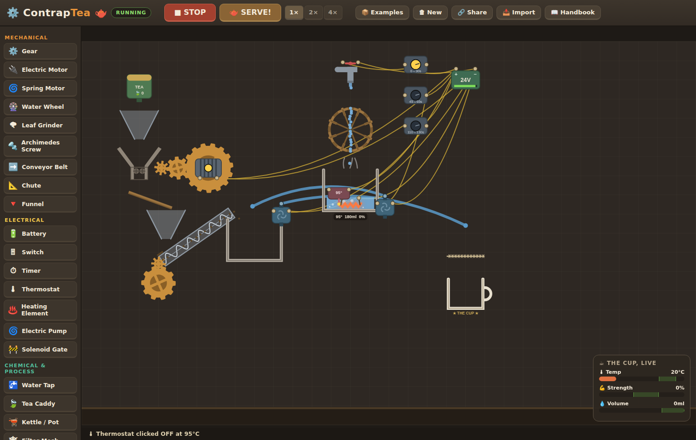
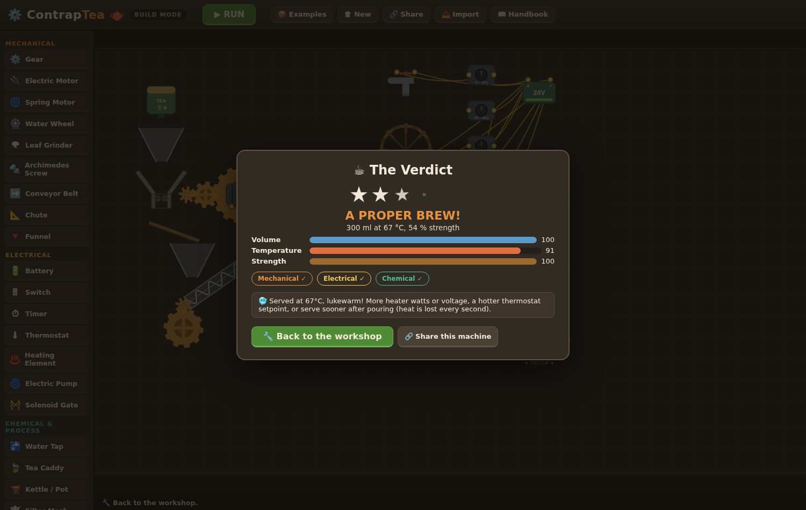

# ContrapTea 🫖

**Build your own tea machine.** A creative 2D engineering sandbox where you assemble a
unique contraption that makes a proper cup of tea — using real (but playful) concepts
from **mechanical**, **electrical** and **chemical** engineering.

There is no fixed solution. Grind your leaves with a motor-driven gear train or steep
them whole; boil with a 24 V heater held at temperature by a thermostat; haul grounds
uphill with an Archimedes screw; spin a water wheel in the tap stream just because you
can. Any machine that gets tea in the cup gets scored — and tips for the next iteration.



## Play it

No build step, no dependencies — it's a static web page:

- **Open `index.html` directly** in any modern browser, or
- serve the folder (`python3 -m http.server`) and visit `http://localhost:8000`, or
- host it on GitHub Pages as-is.

## How to play

1. **BUILD** — click a part in the palette, then click the workshop to place it.
   Drag to move, <kbd>R</kbd> to rotate, <kbd>D</kbd> to duplicate, <kbd>Del</kbd> to delete.
   Drag between the little **terminal dots** to wire circuits; drag from a pump's outlet
   to aim its **hose**.
2. **RUN** — watch your machine operate from t = 0 (1×/2×/4× speed). You can flip
   switches, taps and gates by clicking them mid-run.
3. **SERVE** — the cup is judged on **temperature (70–90 °C)**, **strength (40–70 %)**,
   **volume (≥ 220 ml)** and leafy bits (use a filter!), and you earn a badge for every
   engineering discipline your machine genuinely used.

**On a phone**: the palette becomes a strip along the bottom; drag empty space to pan,
pinch (or use the +/− buttons) to zoom, tap to select and place. On desktop the scroll
wheel zooms too.

Your build auto-saves in the browser. **Share** exports it as a code your friends can
**Import**. Two example machines (📦 Examples) show the range: the electrically
sequenced *Starter Brewery* and the all-three-disciplines *Grand Tea Engine*.



## The engineering

| Discipline | Concepts in play |
|---|---|
| ⚙️ **Mechanical** | gear meshing & ratios, electric/spring motors, water wheel, burr grinder, Archimedes screw, conveyor, statics (chutes & funnels) |
| 🔌 **Electrical** | voltage & finite battery charge, series switches, timers for sequencing, thermostat feedback control, Joule heating, pumps, solenoid valves |
| ⚗️ **Chemical** | extraction kinetics (temperature & surface area — ground ≫ whole leaf), concentration & dilution mass balance, filtration, thermal mass, ambient cooling, evaporation |



## Repo layout

```
index.html          the app shell
css/style.css       workshop styling
js/util.js          math helpers
js/parts.js         part registry (geometry, terminals, pinions, rendering)
js/sim.js           simulation: particles, circuits, gear networks, vessels, chemistry
js/score.js         cup scoring, badges, tips
js/examples.js      the two example machines
js/ui.js            palette, inspector, wiring, modals, save/share
js/main.js          game loop & mode management
DESIGN.md           the full game design document
```

See [DESIGN.md](DESIGN.md) for the design pillars, simulation model and roadmap.
